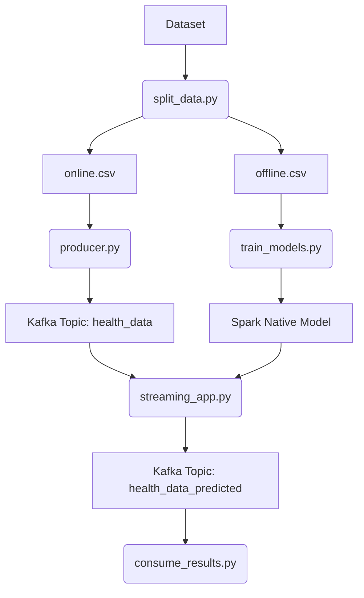

# Diabetes Prediction using Apache Spark & Kafka

Real-time diabetes prediction pipeline using Spark MLlib and Kafka on WSL (Linux).

## Overview
- **Offline Phase**: Trains Logistic Regression, Random Forest, and GBT models. Selects the best performing model (F1-score) and saves it in Spark Native format.
- **Online Phase**: Kafka producer streams health data; Spark Structured Streaming application performs real-time feature engineering and predictions.

## Setup
### Prerequisites
- WSL2 (Ubuntu 24.04 recommended)
- Java 17 (OpenJDK)
- Spark 3.5.0
- Kafka 3.6+

### Dependencies
```bash
pip3 install pyspark==3.5.0 kafka-python-ng pandas scikit-learn
```

## Running the Pipeline
1. **Split Data**:
   ```bash
   python3 data/split_data.py
   ```
2. **Train Model**:
   ```bash
   python3 offline_training/train_models.py
   ```
3. **Start Streaming**:
   ```bash
   python3 online_streaming/streaming_app.py
   ```
4. **Start Producer**:
   ```bash
   python3 producer/producer.py
   ```
5. **Consume Results**:
   ```bash
   python3 online_streaming/consume_results.py
   ```

## Architecture



## Offline Phase: Training Output
This output confirms that the model was trained successfully and saved in the native Spark format.
```
Training models using data/offline.csv...
  > Training LogisticRegression...
  > Training RandomForest...
  > Training GBT...
Best model selected with F1: 0.7502
Model saved natively to models/best_diabetes_model
```

## Online Phase: Streaming Output

### 1. Producer Output (Sending Data)
This output shows the producer reading health records from `online.csv` and sending them to the `health_data` Kafka topic.
```
Connecting to Kafka at localhost:9092...
Loading data from data/online.csv...
Starting to send 6400 records...
Sent 0/6400 records...
Sent 10/6400 records...
Sent 20/6400 records...
...
All records sent!
```

### 2. Consumer Output (Receiving Predictions)
This output from the consumer shows the real-time predictions made by the Spark application processing the producer's data.
```
Prediction: Diabetes Risk | Data: {'HighBP': 1.0, 'HighChol': 1.0, 'CholCheck': 1.0, 'BMI': 31.0, 'Smoker': 1.0, 'Stroke': 0.0, 'HeartDiseaseorAttack': 0.0, 'PhysActivity': 1.0, 'Fruits': 1.0, 'Veggies': 1.0, 'HvyAlcoholConsump': 0.0, 'AnyHealthcare': 1.0, 'NoDocbcCost': 0.0, 'GenHlth': 3.0, 'MentHlth': 0.0, 'PhysHlth': 30.0, 'DiffWalk': 0.0, 'Sex': 1.0, 'Age': 11.0, 'Education': 4.0, 'Income': 8.0, 'prediction': 1.0}
Prediction: Diabetes Risk | Data: {'HighBP': 0.0, 'HighChol': 0.0, 'CholCheck': 1.0, 'BMI': 26.0, 'Smoker': 1.0, 'Stroke': 0.0, 'HeartDiseaseorAttack': 0.0, 'PhysActivity': 1.0, 'Fruits': 1.0, 'Veggies': 1.0, 'HvyAlcoholConsump': 0.0, 'AnyHealthcare': 1.0, 'NoDocbcCost': 0.0, 'GenHlth': 4.0, 'MentHlth': 0.0, 'PhysHlth': 1.0, 'DiffWalk': 0.0, 'Sex': 0.0, 'Age': 13.0, 'Education': 6.0, 'Income': 5.0, 'prediction': 1.0}
Prediction: Healthy | Data: {'HighBP': 0.0, 'HighChol': 0.0, 'CholCheck': 1.0, 'BMI': 29.0, 'Smoker': 0.0, 'Stroke': 0.0, 'HeartDiseaseorAttack': 0.0, 'PhysActivity': 1.0, 'Fruits': 0.0, 'Veggies': 0.0, 'HvyAlcoholConsump': 0.0, 'AnyHealthcare': 1.0, 'NoDocbcCost': 0.0, 'GenHlth': 2.0, 'MentHlth': 0.0, 'PhysHlth': 2.0, 'DiffWalk': 0.0, 'Sex': 1.0, 'Age': 1.0, 'Education': 4.0, 'Income': 3.0, 'prediction': 0.0}
```

Each prediction shows whether the model predicts "Diabetes Risk" or "Healthy" based on health indicators like blood pressure, cholesterol, BMI, age, and lifestyle factors.


